# 🌿 Ladee (ระบบลงเวลาและลางาน)

> **Modern HR Time & Leave Management System**  
> ระบบบริหารจัดการการลาและบันทึกเวลาทำงานยุคใหม่ ออกแบบตามหลักกฎหมายแรงงานไทย ลดความผิดพลาดของมนุษย์ และกระจายอำนาจการอนุมัติตามสายการบังคับบัญชาจริง

[](https://reactjs.org/)
[](https://www.typescriptlang.org/)
[](https://vitejs.dev/)
[](https://tailwindcss.com/)
[](LICENSE)

---

## 📖 ภาพรวมของระบบ (Overview)

**Ladee** พัฒนาขึ้นเพื่อแก้ปัญหาคลาสสิกของฝ่ายบุคคล (HR) และหัวหน้างาน:
- **คำนวณวันลาผิดพลาด:** ลืมตัดวันหยุดเสาร์-อาทิตย์ ทำให้พนักงานเสียสิทธิ์วันลาเกินจริง
- **การลาซ้อนทับ (Double-spending):** พนักงานยื่นคำขอลาหลายใบเกินโควตาพร้อมกันระหว่างรออนุมัติ
- **HR กลายเป็นคอขวด:** HR ต้องมานั่งคอยอนุมัติใบลาทุกคนทั้งองค์กร ทั้งที่ไม่ทราบภาระงานจริงหน้างาน
- **ขาดแคลนแรงงานกะทันหัน:** หัวหน้าเผลออนุมัติใบลาพร้อมกันจนคนทำงานไม่พอเปิดกะ

---

## ✨ คุณสมบัติเด่น (Key Features)

### 1. 📅 การนับวันลาตามวันทำการจริง (Working Days Calculation)
* คำนวณวันลาสุทธิโดยตัดวันหยุดสุดสัปดาห์ (เสาร์-อาทิตย์) ให้อัตโนมัติแบบเรียลไทม์
* ระบบแสดงจำนวนวันทำงานที่ถูกหักจริงชัดเจนก่อนส่งคำขอ

### 2. 🔒 ระบบล็อกโควตาระหว่างรอพิจารณา (Pending Balance Locking)
* หักสิทธิ์วันลาในสถานะ `Pending` ทันทีที่ส่งคำขอ เพื่อป้องกันการยื่นคำขอซ้อนทับเกินโควตาก่อนได้รับการอนุมัติ

### 3. 👥 การกระจายสิทธิ์ตามสายบังคับบัญชา (Decentralized Approval)
* **พนักงาน ➔ หัวหน้าแผนก:** หัวหน้าแผนกเป็นผู้พิจารณาอนุมัติ/ปฏิเสธลูกทีมตนเอง (พร้อมบังคับระบุเหตุผลเมื่อไม่อนุมัติ)
* **หัวหน้าแผนก ➔ HR:** คำขอลาของระดับหัวหน้างานจะถูกส่งต่อให้ HR พิจารณาเท่านั้น
* **ป้องกันการอนุมัติตนเอง (No Self-Approval):** หัวหน้างานไม่สามารถกดอนุมัติคำขอลาของตนเองได้
* **ระบบช่วยอนุมัติเมื่อเกินกำหนด (Smart Escalation):** HR จะไม่ข้ามหน้าหัวหน้าแผนก ยกเว้นคำขอที่ค้างนานเกินกำหนด (`isEscalated === true`) จึงจะปลดล็อกให้ HR กดอนุมัติแทนได้

### 4. ⚠️ แจ้งเตือนกำลังคนขั้นต่ำ (Manpower Safeguard)
* ประเมินอัตรากำลังคนขั้นต่ำ (`minRequiredStaff`) ของแต่ละแผนกแบบเรียลไทม์
* ขึ้นป้ายเตือนทันทีหากการอนุมัติคำขอนั้นจะทำให้จำนวนคนทำงานในวันดังกล่าวต่ำกว่าเกณฑ์

### 5. ⏱️ บันทึกเวลาเข้า-ออกงาน & Log รายบุคคล (Attendance Tracking)
* รองรับการลงเวลา Check-in และ Check-out ประจำวัน
* มีปุ่มเปิดดู Log ประวัติการลงเวลาย้อนหลังของพนักงานได้ทันทีจากหน้าจออนุมัติคำขอลา

### 6. 🛡️ ขอบเขตข้อมูลตามบทบาท (Data Isolation)
* หัวหน้าแผนกเห็นเฉพาะข้อมูลพนักงานในแผนกของตนเอง
* HR และผู้บริหารระดับสูงสามารถเรียกดูภาพรวมได้ทั้งบริษัท

---

## 🏗️ สถาปัตยกรรมระบบ (System Architecture)

```mermaid
flowchart TD

subgraph group_app["Application"]
  node_app["App routing<br/>[App.tsx]"]
  node_context["App state<br/>[AppContext.tsx]"]
  node_login["Login<br/>[Login.tsx]"]
  node_employee["Employee dashboard"]
end

subgraph group_leave["Leave workflow"]
  node_leaveform["Leave request<br/>[LeaveForm.tsx]"]
  node_history["Leave history<br/>[LeaveHistory.tsx]"]
  node_approvals["Approval list<br/>[ApprovalList.tsx]"]
end

subgraph group_workforce["Workforce tools"]
  node_manager["Manager dashboard"]
  node_hr["HR dashboard"]
  node_today["Working today<br/>[WorkingToday.tsx]"]
  node_staffing["Staffing calculations<br/>[staffing.ts]"]
end

subgraph group_state["State and rules"]
  node_approvalrules["Approval rules<br/>[approval.ts]"]
  node_dates["Date utilities<br/>[date.ts]"]
  node_storage[("Local storage<br/>[storage.ts]")]
  node_employees["Employee seed data<br/>[employees.ts]"]
  node_leaveseed["Leave seed data<br/>[leaveRequests.ts]"]
  node_departments["Departments<br/>[departments.ts]"]
  node_types["HR data types<br/>[index.ts]"]
  node_attendance["Attendance records<br/>[AppContext.tsx]"]
end

node_people(("HR users"))

node_people -->|"use app"| node_app
node_app -->|"provides state"| node_context
node_app -->|"routes"| node_login
node_app -->|"routes"| node_employee
node_app -->|"routes"| node_leaveform
node_app -->|"routes"| node_history
node_app -->|"routes"| node_approvals
node_app -->|"routes"| node_manager
node_app -->|"routes"| node_hr
node_app -->|"routes"| node_today
node_login -->|"authenticates"| node_context
node_leaveform -->|"submits request"| node_context
node_manager -->|"calculates staffing"| node_staffing
node_manager -->|"formats dates"| node_dates
node_context -->|"guards decisions"| node_approvalrules
node_context -->|"counts leave days"| node_dates
node_context -->|"reads and writes"| node_storage
node_context -->|"loads defaults"| node_employees
node_context -->|"loads defaults"| node_leaveseed
node_context -->|"provides departments"| node_departments
node_context -->|"manages attendance"| node_attendance
node_context -->|"uses data types"| node_types

click node_app "[https://github.com/superworgurn/ladee/blob/main/src/App.tsx](https://github.com/superworgurn/ladee/blob/main/src/App.tsx)"
click node_context "[https://github.com/superworgurn/ladee/blob/main/src/context/AppContext.tsx](https://github.com/superworgurn/ladee/blob/main/src/context/AppContext.tsx)"
click node_login "[https://github.com/superworgurn/ladee/blob/main/src/pages/Login.tsx](https://github.com/superworgurn/ladee/blob/main/src/pages/Login.tsx)"
click node_employee "[https://github.com/superworgurn/ladee/blob/main/src/pages/EmployeeDashboard.tsx](https://github.com/superworgurn/ladee/blob/main/src/pages/EmployeeDashboard.tsx)"
click node_leaveform "[https://github.com/superworgurn/ladee/blob/main/src/pages/LeaveForm.tsx](https://github.com/superworgurn/ladee/blob/main/src/pages/LeaveForm.tsx)"
click node_history "[https://github.com/superworgurn/ladee/blob/main/src/pages/LeaveHistory.tsx](https://github.com/superworgurn/ladee/blob/main/src/pages/LeaveHistory.tsx)"
click node_approvals "[https://github.com/superworgurn/ladee/blob/main/src/pages/ApprovalList.tsx](https://github.com/superworgurn/ladee/blob/main/src/pages/ApprovalList.tsx)"
click node_manager "[https://github.com/superworgurn/ladee/blob/main/src/pages/ManagerDashboard.tsx](https://github.com/superworgurn/ladee/blob/main/src/pages/ManagerDashboard.tsx)"
click node_hr "[https://github.com/superworgurn/ladee/blob/main/src/pages/HRAdminDashboard.tsx](https://github.com/superworgurn/ladee/blob/main/src/pages/HRAdminDashboard.tsx)"
click node_today "[https://github.com/superworgurn/ladee/blob/main/src/pages/WorkingToday.tsx](https://github.com/superworgurn/ladee/blob/main/src/pages/WorkingToday.tsx)"
click node_approvalrules "[https://github.com/superworgurn/ladee/blob/main/src/utils/approval.ts](https://github.com/superworgurn/ladee/blob/main/src/utils/approval.ts)"
click node_staffing "[https://github.com/superworgurn/ladee/blob/main/src/utils/staffing.ts](https://github.com/superworgurn/ladee/blob/main/src/utils/staffing.ts)"
click node_dates "[https://github.com/superworgurn/ladee/blob/main/src/utils/date.ts](https://github.com/superworgurn/ladee/blob/main/src/utils/date.ts)"
click node_storage "[https://github.com/superworgurn/ladee/blob/main/src/utils/storage.ts](https://github.com/superworgurn/ladee/blob/main/src/utils/storage.ts)"
click node_employees "[https://github.com/superworgurn/ladee/blob/main/src/data/employees.ts](https://github.com/superworgurn/ladee/blob/main/src/data/employees.ts)"
click node_leaveseed "[https://github.com/superworgurn/ladee/blob/main/src/data/leaveRequests.ts](https://github.com/superworgurn/ladee/blob/main/src/data/leaveRequests.ts)"
click node_departments "[https://github.com/superworgurn/ladee/blob/main/src/data/departments.ts](https://github.com/superworgurn/ladee/blob/main/src/data/departments.ts)"
click node_types "[https://github.com/superworgurn/ladee/blob/main/src/types/index.ts](https://github.com/superworgurn/ladee/blob/main/src/types/index.ts)"
click node_attendance "[https://github.com/superworgurn/ladee/blob/main/src/context/AppContext.tsx](https://github.com/superworgurn/ladee/blob/main/src/context/AppContext.tsx)"

classDef toneNeutral fill:#f8fafc,stroke:#334155,stroke-width:1.5px,color:#0f172a
classDef toneBlue fill:#dbeafe,stroke:#2563eb,stroke-width:1.5px,color:#172554
classDef toneAmber fill:#fef3c7,stroke:#d97706,stroke-width:1.5px,color:#78350f
classDef toneMint fill:#dcfce7,stroke:#16a34a,stroke-width:1.5px,color:#14532d
classDef toneRose fill:#ffe4e6,stroke:#e11d48,stroke-width:1.5px,color:#881337
classDef toneIndigo fill:#e0e7ff,stroke:#4f46e5,stroke-width:1.5px,color:#312e81
classDef toneTeal fill:#ccfbf1,stroke:#0f766e,stroke-width:1.5px,color:#134e4a
class node_app,node_context,node_login,node_employee,node_people toneBlue
class node_leaveform,node_history,node_approvals toneAmber
class node_manager,node_hr,node_today,node_staffing toneMint
class node_approvalrules,node_dates,node_storage,node_employees,node_leaveseed,node_departments,node_types,node_attendance toneRose

```




## 🚦 ตารางสิทธิ์การใช้งาน (Role Matrix)

| ฟังก์ชันการทำงาน | พนักงาน (Employee) | หัวหน้าแผนก (Manager) | ฝ่ายบุคคล (HR Admin) |
| :--- | :---: | :---: | :---: |
| ลงเวลาเข้า-ออกงาน (Check-in / Out) | ✅ | ✅ | ✅ |
| ยื่นใบลา (Leave Request) | ✅ | ✅ (ส่งหา HR) | ⚠️ (โหมดสาธิต) |
| ดูประวัติการลาส่วนตัว | ✅ | ✅ | ✅ |
| อนุมัติใบลาลูกทีม | ❌ | ✅ (เฉพาะแผนกตนเอง) | ⚠️ (เฉพาะเคสเกินกำหนด) |
| อนุมัติใบลาหัวหน้าแผนก | ❌ | ❌ | ✅ |
| ดูรายชื่อคนทำงานวันนี้ (`/working-today`) | แผนกตนเอง | แผนกตนเอง | ทุกแผนก |
| ตรวจสอบ Audit Log | ❌ | แผนกตนเอง | ภาพรวมทั้งบริษัท |

## 🛠️ เทคโนโลยีที่ใช้ (Tech Stack)

-   **Frontend:** [React 18](https://www.blockdit.com/posts/68a2cf1db8c4265b7aa8de41), [TypeScript](https://www.blockdit.com/posts/688b0c3eb2ed8f60ad5b1d3f)
    
      
    
-   **Build Tool:** [Vite 5](https://vitejs.dev/?utm_source=gemini)
    
      
    
-   **Routing:** [React Router DOM v6](https://www.blockdit.com/posts/6933b92f61fd0b95c97d8450)
    
      
    
-   **Styling:** [Tailwind CSS v4](https://www.blockdit.com/posts/685781c953a51728b2bf0555)
    
      
    
-   **State & Persistence:** React Context API + LocalStorage Adapter
    
      
    

## 🚀 เริ่มต้นใช้งาน (Getting Started)

### 1. ติดตั้ง Dependencies

Bash

```
git clone https://github.com/superworgurn/ladee.git
cd ladee
npm install
```

### 2. รันโหมด Development

Bash

```
npm run dev
```

เปิดเบราว์เซอร์ไปที่ `http://localhost:5173`

  

### 3. บิลด์สำหรับ Production

Bash

```
npm run build
npm run preview
```

### 4. ทดสอบผ่าน Cloudflare Quick Tunnel (Docker)

หากต้องการทดสอบผ่านอินเทอร์เน็ตบนอุปกรณ์อื่นโดยไม่ต้องตั้งค่า Domain:

  

Bash

```
# รัน Cloudflared tunnel ผ่าน Docker (อีกหน้าต่าง Terminal)
docker run --rm -it cloudflare/cloudflared:latest tunnel --url http://host.docker.internal:5173
```

## 📁 โครงสร้างโปรเจกต์ (Project Structure)


```
src/
├── components/          # Reusable UI (Navbar, Badge, Card, Modal, Toast)
├── context/             # AppContext จัดการ State กลางและการลงเวลา
├── data/                # Initial Seed Data (พนักงาน, แผนก, คำขอลา)
├── pages/               # หน้าจอแดชบอร์ด, ฟอร์มลา, รายการอนุมัติ, ประวัติ
├── types/               # TypeScript Interface และ Type นิยามข้อมูล HR
└── utils/               # ฟังก์ชันคำนวณวันลา, สิทธิ์อนุมัติ, กำลังคน, Storage

```

## 📄 ใบอนุญาต (License)

โปรเจกต์นี้เผยแพร่ภายใต้ใบอนุญาต [MIT License](https://github.com/superworgurn/ladee/blob/main/LICENSE)
